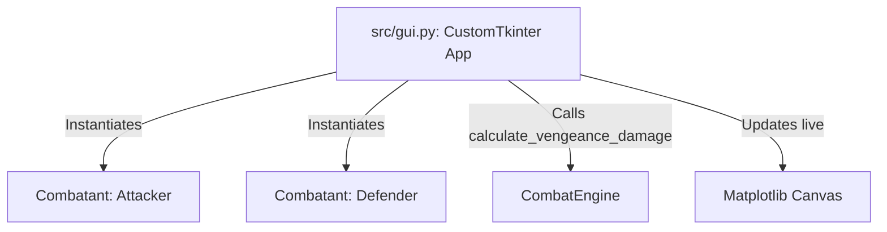

# SMTV Vengeance GUI Design Specification

**Date:** 2026-06-01  
**Goal:** Implement a responsive, modern desktop GUI for SMTV Vengeance damage simulation to allow interactive custom Nahobino designing and live damage calculations.

---

## 1. System Architecture



### 1.1 Files to Create/Modify
- **New File**: `src/gui.py` - CustomTkinter UI logic, event bindings, and Matplotlib integration.
- **Modified File**: `requirements.txt` - Add `customtkinter` dependency.
- **Modified File**: `src/runner.py` - Add `--gui` flag to allow easy launch: `python -m src.runner --gui`.

---

## 2. Interface Component Layout

The interface is structured in a three-column layout:

### 2.1 Left Column: Nahobino Designer
- **Character Base Setup**:
  - Sliders for Attacker Level (1-99).
  - Number inputs / spinboxes for raw STR, MAG, and LUC stats.
- **Skill Customization**:
  - Dropdown for active element: `[phys, fire, ice, elec, wind, light, dark, force, magic]`.
  - Dropdown for skill power presets:
    - *Light (30 power)*
    - *Medium (70 power)*
    - *Heavy (120 power)*
    - *Severe (200 power)*
  - Potential slider/spinner: `-9 to +9`.
- **Active Modifiers**:
  - Radio buttons/dropdown for Charge state: `None, Charge, Concentrate, Impaler's Glory`.
  - Checkboxes for passive abilities: `[ ] Critical Zealot`, `[ ] Murderous Glee`.

### 2.2 Middle Column: Target & Buffs Designer
- **Target Setup**:
  - Sliders for Defender Level (1-99).
  - Number inputs / spinboxes for raw VIT stat.
  - Elemental resistance dropdown: `[immune, drain, repel, resist, neutral, weak]`.
  - Toggles/checkboxes: `[ ] Guarding`, `[ ] Doubler Bug Active`.
- **Buff / Debuff Scaling**:
  - Slider for Attacker STR Buff: `-3 to +3`.
  - Slider for Defender VIT Debuff: `-3 to +3`.

### 2.3 Right Column: Live Results Dashboard
- **Damage Cards (Large Typography)**:
  - **Normal Hit Card**: Displays damage for normal hits (e.g., standard background).
  - **Critical Hit Card**: Displays damage on critical hit (e.g., highlighted background).
  - **Expected Damage Card**: Displays probability-weighted expected damage (e.g., green highlight).
- **Embedded Matplotlib Chart**:
  - Real-time line graph displaying damage output as Attacker STR Buff scales from -3 to +3.
  - Highlights a vertical marker at the current selected STR buff level.

---

## 3. Data Flow & Matplotlib Integration

### 3.1 Event Handling
- UI elements bind all changes (slider move, checkbox click, dropdown select) to a single callback: `update_simulation()`.
- Updates occur instantly without requiring a manual "Run" button.

### 3.2 Live Rendering loop
Inside `update_simulation()`:
1. Parse all widget configurations to build `Combatant` objects for both Attacker and Defender.
2. Instantiate `CombatEngine` with the correct skill power.
3. Calculate output damage values.
4. Update results dashboard text card labels.
5. Recalculate progressive damage array across the STR buff range (-3 to +3).
6. Clear and redraw Matplotlib canvas:
   ```python
   fig.clear()
   ax = fig.add_subplot(111)
   ax.plot(buff_range, damage_range, marker='o')
   ax.axvline(x=current_buff, color='red', linestyle='--')
   canvas.draw()
   ```

---

## 4. Self-Review Checklist

- [x] **Placeholder Scan**: No TBD/TODO markers. Power presets and formulas fully specified.
- [x] **Consistency**: Data flow strictly matches `CombatEngine` requirements.
- [x] **Backward Compatibility**: Existing CLI and unit tests remain unaffected.
- [x] **Scope**: Clearly focused on CustomTkinter UI rendering and calculation pipeline integration.
